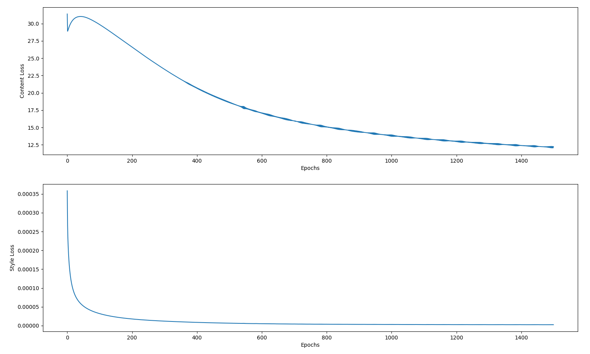

# Neural-Style-Transfer-using-VGG19-PyTorch
The objective of this project is to implement neural style transfer using pretrained VGG-19 convolutional neural network to create a new image that follows the content of one image and the style of another image. 
The target image is initialized with random noise.

## Feature Maps and Gram Matrices
The feature activation maps of content image and style image were obtained from the conv2d layers of the VGG19 network. The gram matrices were calculated for the style image from the feature maps. 
### Visualize Content Feature Maps and Content Gram Matrices

### Visualize Style Feature Maps and Style Gram Matrices

## Loss Function 
The content loss was calculated as the mse between content image feature maps and target image feature maps. 
 The style loss was calculated as the mse between style gram matrices and target gram matrices. 
 The target image was trained on 1500 epochs.
### Final Stylized Version of Content Image 
Conv1 layer and Conv4 layer was used for content-matching 
  Conv0 layer to Conv4 layer was used for style-matching
  The style loss gain factors used were [1, 0.5, 0.5, 0.4, 0.2, 0.1]

### Target Image Transformation every 100 epochs 

### Content and Style Loss Curves

